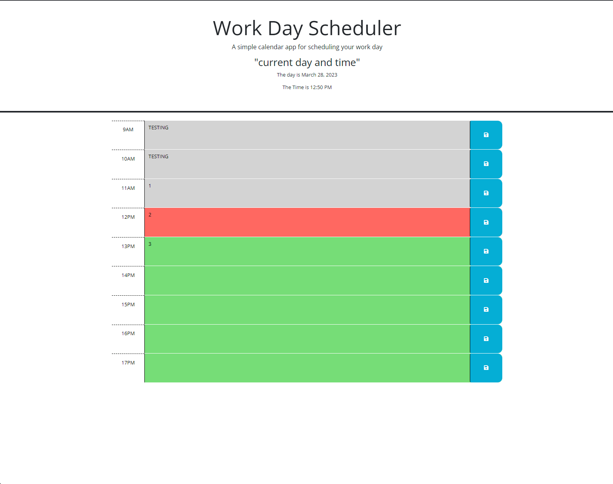

# Work-Day-Scheduler

## Time management
```
 In this time management application, we can view color coded time slots that indicate the past present or future, in relation to the current day and time. Users are also able to save text in the chosen time slot.
```

The following is a screenshot from a functioning workday scheduler application.



[Please click on this link to view application](https://ggdave.github.io/Work-Day-Scheduler/)
